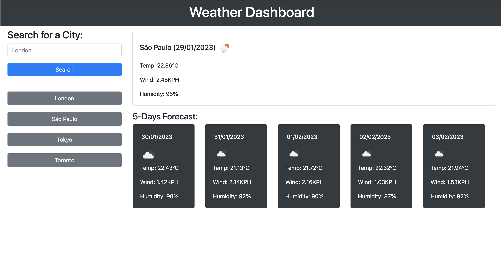

# weather-dashboard
<!-- Improved compatibility of back to top link: See: https://github.com/othneildrew/Best-README-Template/pull/73 -->
<a name="readme-top"></a>

<!-- PROJECT SHIELDS -->
<!--
*** I'm using markdown "reference style" links for readability.
*** Reference links are enclosed in brackets [ ] instead of parentheses ( ).
*** See the bottom of this document for the declaration of the reference variables
*** for contributors-url, forks-url, etc. This is an optional, concise syntax you may use.
*** https://www.markdownguide.org/basic-syntax/#reference-style-links
-->
[![Contributors][contributors-shield]][contributors-url]
[![Forks][forks-shield]][forks-url]
[![Stargazers][stars-shield]][stars-url]
[![Issues][issues-shield]][issues-url]
[![MIT License][license-shield]][license-url]
[![LinkedIn][linkedin-shield]][linkedin-url]


<!-- PROJECT LOGO -->
<br />
<div align="center">
  <a href="https://fl4viooliveira.github.io/weather-dashboard/">
    
  </a>

<h3 align="center">Weather Dashboard</h3>

  <p align="center">
    Module 8 Challenge: Weather Dashboard
    <br />
    <a href="https://github.com/fl4viooliveira/weather-dashboard"><strong>Explore the docs »</strong></a>
    <br />
    <br />
    <a href="https://fl4viooliveira.github.io/weather-dashboard/">View Demo</a>
    ·
    <a href="https://github.com/fl4viooliveira/weather-dashboard/issues">Report Bug</a>
    ·
    <a href="https://github.com/fl4viooliveira/weather-dashboard/issues">Request Feature</a>
  </p>
</div>


<!-- TABLE OF CONTENTS -->
<details>
  <summary>Table of Contents</summary>
  <ol>
    <li>
      <a href="#about-the-project">About The Project</a>
      <ul>
        <li><a href="#built-with">Built With</a></li>
      </ul>
    </li>
    <li>
      <a href="#getting-started">Getting Started</a>
      <ul>
        <li><a href="#prerequisites">Prerequisites</a></li>
        <li><a href="#installation">Installation</a></li>
      </ul>
    </li>
    <li><a href="#contributing">Contributing</a></li>
    <li><a href="#license">License</a></li>
    <li><a href="#contact">Contact</a></li>
    <li><a href="#acknowledgments">Acknowledgments</a></li>
  </ol>
</details>


<!-- ABOUT THE PROJECT -->
## About The Project

[![Weather Dashboard][product-screenshot]](https://fl4viooliveira.github.io/weather-dashboard/)

## Overview

In this Challenge, you'll create an app that allows users to see the weather forecast for cities of their choosing.
## Instructions

### Server APIs: Weather Dashboard
Server APIs allow developers to access their data and functionality by making requests with specific parameters to a URL. 
Developers are often tasked with retrieving data from another application's API and using it in the context of their own. 
Your Challenge is to build a weather dashboard that will run in the browser and feature dynamically updated HTML and CSS.

<p align="right">(<a href="#readme-top">back to top</a>)</p>


### Built With

* [![JavaScript][JavaScript]][JavaScript-url]
* [![Bootstrap][Bootstrap.com]][Bootstrap-url]
* [![JQuery][JQuery.com]][JQuery-url]
* [![OpenWeather][OpenWeather.org]][OpenWeather-url]

<p align="right">(<a href="#readme-top">back to top</a>)</p>


<!-- GETTING STARTED -->
## Getting Started

_To get a local copy up and running, follow these simple example steps._


### Prerequisites

Use the 5 Day Weather Forecast to retrieve weather data for cities. 
The base URL for your API calls should look like the following: 

```
https://api.openweathermap.org/data/2.5/forecast?q={City}&appid={API key}.
```

* none

### Installation

_To install, on the terminal type:_
   ```sh
   git clone git@github.com:fl4viooliveira/weather-dashboard.git
   ```
<p align="right">(<a href="#readme-top">back to top</a>)</p>


<!-- CONTRIBUTING -->
## Contributing

Contributions are what make the open source community such an amazing place to learn, inspire, and create. Any contributions you make are **greatly appreciated**.

If you have a suggestion that would make this better, please fork the repo and create a pull request. You can also simply open an issue with the tag "enhancement".
Don't forget to give the project a star! Thanks again!

1. Fork the Project
2. Create your Feature Branch (`git checkout -b feature/AmazingFeature`)
3. Commit your Changes (`git commit -m 'Add some AmazingFeature'`)
4. Push to the Branch (`git push origin feature/AmazingFeature`)
5. Open a Pull Request

<p align="right">(<a href="#readme-top">back to top</a>)</p>


<!-- LICENSE -->
## License

Distributed under the MIT License. See `LICENSE.txt` for more information.

<p align="right">(<a href="#readme-top">back to top</a>)</p>


<!-- CONTACT -->
## Contact

Flavio Oliveira - [@fl4viooliveira](https://twitter.com/fl4viooliveira) 

Project Link: [https://github.com/fl4viooliveira/weather-dashboard](https://github.com/fl4viooliveira/weather-dashboard)

<p align="right">(<a href="#readme-top">back to top</a>)</p>


<!-- ACKNOWLEDGMENTS -->
## Acknowledgments

* [Best-README-Template](https://github.com/othneildrew/Best-README-Template)

<p align="right">(<a href="#readme-top">back to top</a>)</p>


<!-- MARKDOWN LINKS & IMAGES -->
<!-- https://www.markdownguide.org/basic-syntax/#reference-style-links -->
[contributors-shield]: https://img.shields.io/github/contributors/fl4viooliveira/weather-dashboard.svg?style=for-the-badge
[contributors-url]: https://github.com/fl4viooliveira/weather-dashboard/graphs/contributors
[forks-shield]: https://img.shields.io/github/forks/fl4viooliveira/weather-dashboard.svg?style=for-the-badge
[forks-url]: https://github.com/fl4viooliveira/weather-dashboard/network/members
[stars-shield]: https://img.shields.io/github/stars/fl4viooliveira/weather-dashboard.svg?style=for-the-badge
[stars-url]: https://github.com/fl4viooliveira/weather-dashboard/stargazers
[issues-shield]: https://img.shields.io/github/issues/fl4viooliveira/weather-dashboard?style=for-the-badge
[issues-url]: https://github.com/fl4viooliveira/weather-dashboard/issues
[license-shield]: https://img.shields.io/github/license/fl4viooliveira/weather-dashboard.svg?style=for-the-badge
[license-url]: https://github.com/fl4viooliveira/weather-dashboard/blob/master/LICENSE.txt
[linkedin-shield]: https://img.shields.io/badge/-LinkedIn-black.svg?style=for-the-badge&logo=linkedin&colorB=555
[linkedin-url]: https://linkedin.com/in/fl4viooliveira
[product-screenshot]: ./assets/img/page.png

[JavaScript]: https://img.shields.io/badge/JavaScript-F7E037?style=for-the-badge&logo=javascript&logoColor=black
[JavaScript-url]: https://developer.mozilla.org/en-US/docs/Web/JavaScript
[Bootstrap.com]: https://img.shields.io/badge/Bootstrap-563D7C?style=for-the-badge&logo=bootstrap&logoColor=white
[Bootstrap-url]: https://getbootstrap.com
[JQuery.com]: https://img.shields.io/badge/jQuery-0769AD?style=for-the-badge&logo=jquery&logoColor=white
[JQuery-url]: https://jquery.com 
[OpenWeather.org]: https://img.shields.io/badge/OpenWeather-EA6C4B?style=for-the-badge&logo=OpenWeather&logoColor=white
[OpenWeather-url]: https://openweathermap.org 
